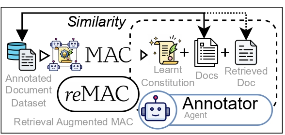
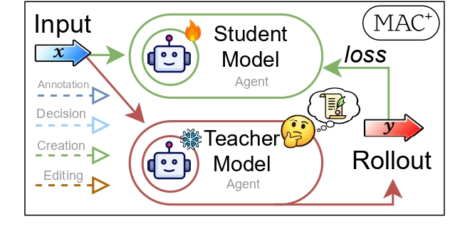

# MAC Variants and Extended Paper Results

Advanced results from the MAC paper covering retrieval-augmented inference, agent distillation, and tool-calling extensions.

---

## reMAC (Retrieval-Augmented Inference)

At inference time, reMAC retrieves the most similar training document and
appends it to the annotator's context alongside the learned constitution.
This combines rule-based guidance with example-based grounding.

  

- Improves **all 18** configurations (3 domains x 3 scales x 2 retrieval modes)
- Healthcare 7B: **+273%** (9.9 to 37.0 F1)
- Average relative gain: 75.5% (3B), 90.4% (7B), 69.4% (14B)

Full reMAC tables (random + similarity retrieval)

**Random retrieval:**

| Domain | 3B | 7B | 14B |
|:------:|:--:|:--:|:---:|
| Legal | 41.5 | 61.3 | 71.0 |
| Finance | 34.3 | 40.7 | 48.2 |
| Healthcare | 17.8 | 33.4 | 29.5 |

**Similarity retrieval:**

| Domain | 3B | 7B | 14B |
|:------:|:--:|:--:|:---:|
| Legal | 43.2 | 62.8 | 72.1 |
| Finance | 35.1 | 42.3 | 49.8 |
| Healthcare | 19.2 | 37.0 | 31.7 |

---

## MAC+ (Agent Distillation)

MAC+ distills the MAC training loop into a smaller student model via
rollout-based fine-tuning. The student learns to perform all four agent
roles (annotate, decide, propose, edit) from teacher demonstrations.

  

| Method | F1 |
|:------:|:--:|
| GRPO | 39.7 |
| SFT | 56.6 |
| **MAC+** | **59.0** |

Per-agent accuracy after distillation:

| Agent | Before | After |
|:-----:|:------:|:-----:|
| Decision | 9% | **86%** |
| Proposer | 3% | **97%** |
| Editor | 25% | **74%** |

---

## Tool-MAC

MAC applied to tool-calling: **+5.5%** on the BFCL benchmark, showing that
constitution learning generalizes beyond text annotation to structured
API call generation.
